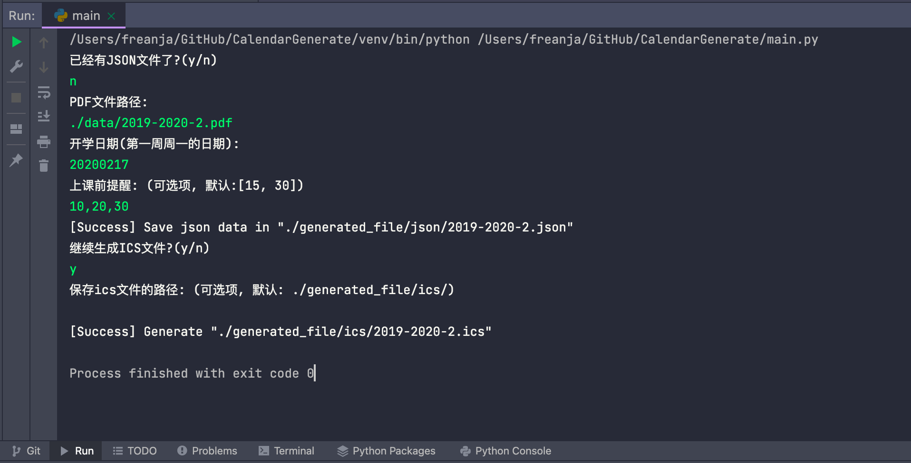
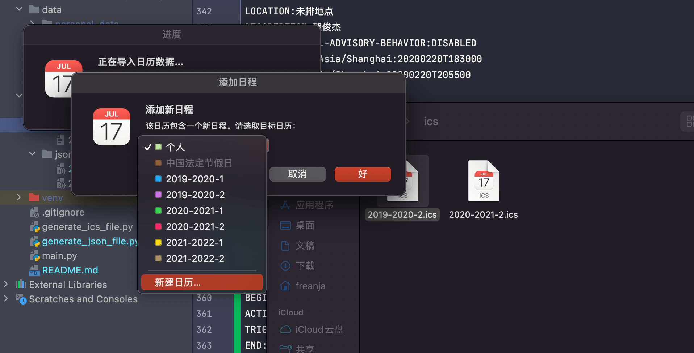
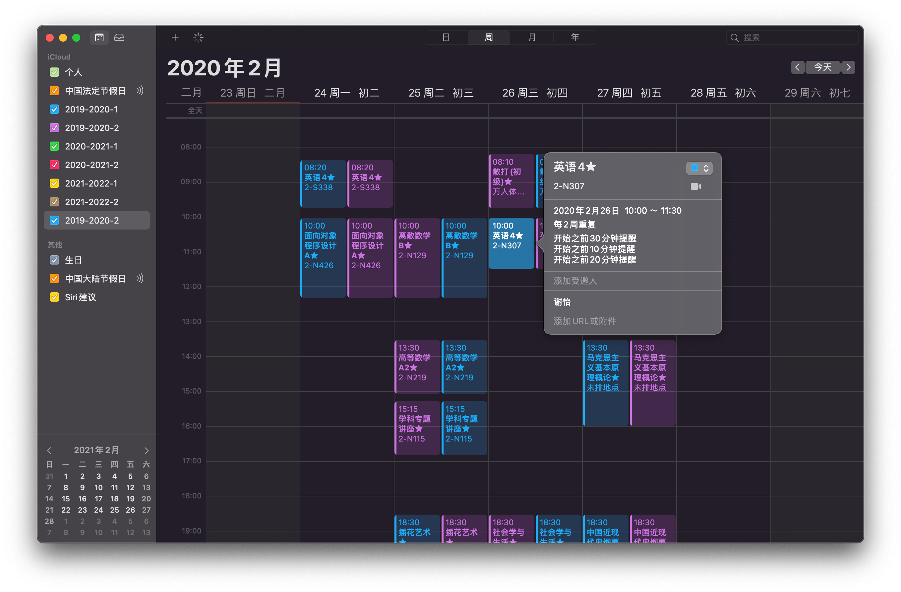

# 日历生成 CalendarGenerate ( for Zstuer )

  

> 根据zstu教务系统下载的pdf课表，生成json和ics文件，方便批量导入到个人日历软件

> A project that can let ZSTU Educational administration system exported pdf schedule file automatically generates ics files to import into the system calendar

---

 

## 🤔 Why do this

Apple 全家桶下直接使用系统日历真的太香了，但每学期开学导课表真的要了命了，无意间少数派看到个[帖子](https://sspai.com/post/39645)提醒了我，我是学 计算机的 ~~菜狗~~ 啊

看了下帖子之后，决定自己也动手写一个，之所以没有直接白嫖 🤲，有几个原因：

* 原作者使用的方法是 先在Execl中输入课程信息，生成json文件，然后将json文件合并生成ics，但是作为 **懒狗** 我连Execl也不想写
* 原作者生成的日历格式和我想要的不太一样 
* ~~装 X~~

 

 

## 👩🏻‍🔬 Programming

> 几乎都是逼逼赖赖，建议直接忽略跳过这个Part，有兴趣可以直接看源码

最开始的时候是没想到直接读pdf文件的，正常人想的应该是爬 ~~教务系统（退学警告）~~

为什么不直接拿网页上的数据？是有什么隐秘🔏么？

~是的，我爬虫用的不熟😅~

 

总之最后选择了直接读pdf文件，试了几个py的pdf库之后，用了 **pdfplumber**，读中文文档很友好 👍，如果是读中文文档的话非常推荐使用

然后就是最痛苦的部分，生成**JSON**文件，我想到过pdf转文字生成的列表会很混乱，没想到会乱成这种，在我整理的要放弃的时候，发现教务系统支持倒出的pdf里面竟然有一种列表样式的，果断换了列表的，磕磕绊绊总算是把JSON文件生成好了。~然后开学已经一个月了，我就再也没点开过这个Project😅~

寒假又换了台新电脑，开学的时候写的文件忘记备份了，也没传github，好嘛直接重写🥲

 

Anyway，在寒假的末尾花了两三天算是搞完了，总结下整个过程：

* **JSON部分** 主要就是信息的提取和格式整理 ~~好像整个项目都是~~ 

* **ICS部分** 主要是阅读和尝试能否正常使用吧，我是在电脑里面导出之前的日程，然后以此为模版进行修改使用

 

 

##  💡 How to use

> 介绍下怎么使用，虽然感觉没啥好介绍的，之后有空的话🐦会直接在博客上开个接口，上传课表直接返回一个ics

***先声明这是根据浙江理工大学2021-2022学年寒假教务系统下载的学生课表，列表模式进行开发的，pdf转文本有很多奇怪的格式，请参考DATA文件夹下给出的两个pdf文档判断是否适用‼️***

运行 **main.py** 文件，按照提示进行输入即可，需要注意的是 **开学日期填写第一周的周一的日期！**

默认在上课前15分钟和30分钟提醒两次，如果需要修改输入以 **,** 分割的数字，提醒时间 **暂不提供每门课自定义** ，有需要可以导入日历后在日历中事件第一次出现处修改

另外，因为我的过往课表中就碰到过一次英语课双周，所以只设置了单双周，如果有别的什么奇奇怪怪的上课频率，自己改代码，或者也可以[联系我](#jump)，当然其他问题也等同 ~~pdf转文字出现的格式真的是千奇百怪了~~

下面跑一次代码，可供参考

⬆️ 运行完成后可以查看给出的路径是否有生成的文件

⬆️ 点开ics文件，选择 **新建日历**，会自动根据学期创建一个新的日历（当然你也可以选择已有的日历）

⬆️ 这是导入后的样式，我点开了我那门双周的英语课，你可以在 **每2周重复** 处修改你的重复规则

 

 

## 🤝 Connect with Me

  

 

 

##  💫 The End

<a href="https://www.tumblr.com/blog/view/1041uuu">Awesome 8 Bit</a>

-----

